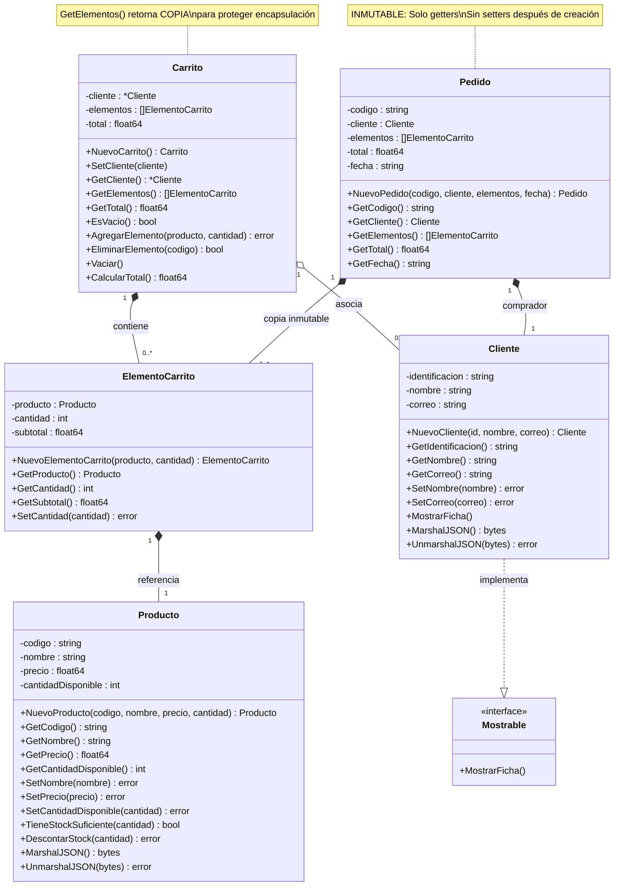
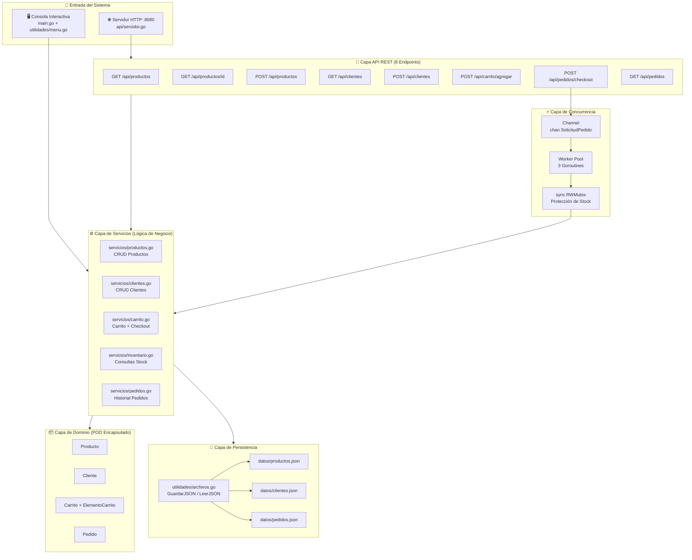
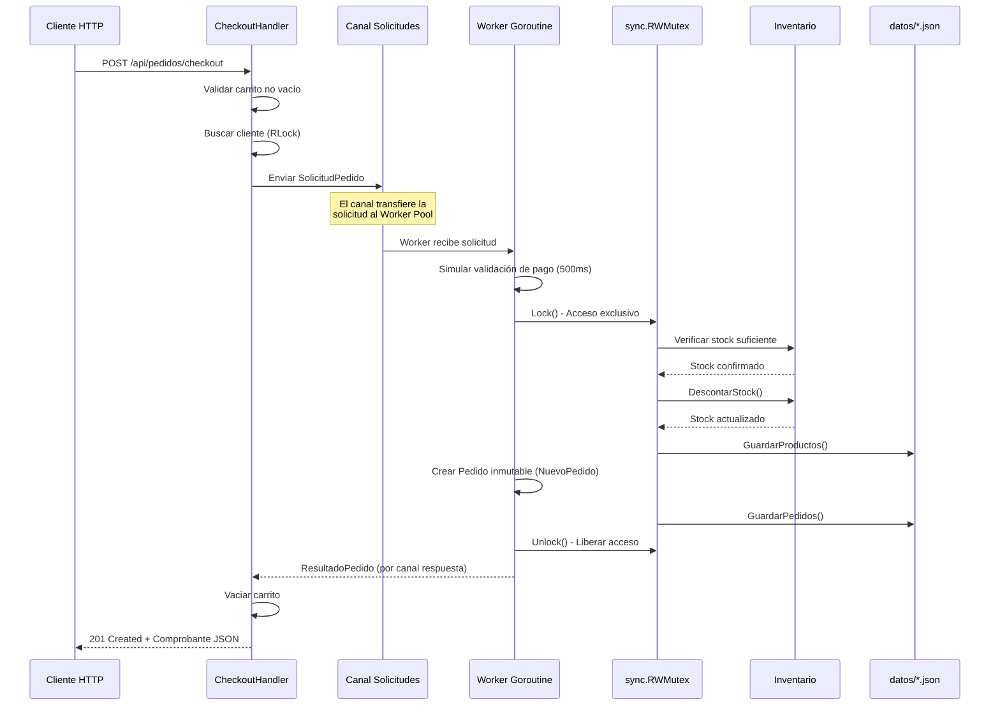
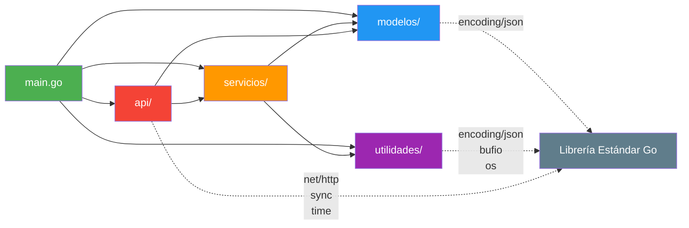

# Diagramas de Arquitectura y Clases — Sistema de E-Commerce

> Estos diagramas están escritos en sintaxis [Mermaid](https://mermaid.js.org/) y renderizan automáticamente en GitHub.

---

## 1. Diagrama de Clases POO (Encapsulación)

---

## 2. Diagrama de Arquitectura por Capas

---

## 3. Diagrama de Flujo de Concurrencia (Checkout)

---

## 4. Diagrama de Paquetes y Dependencias

